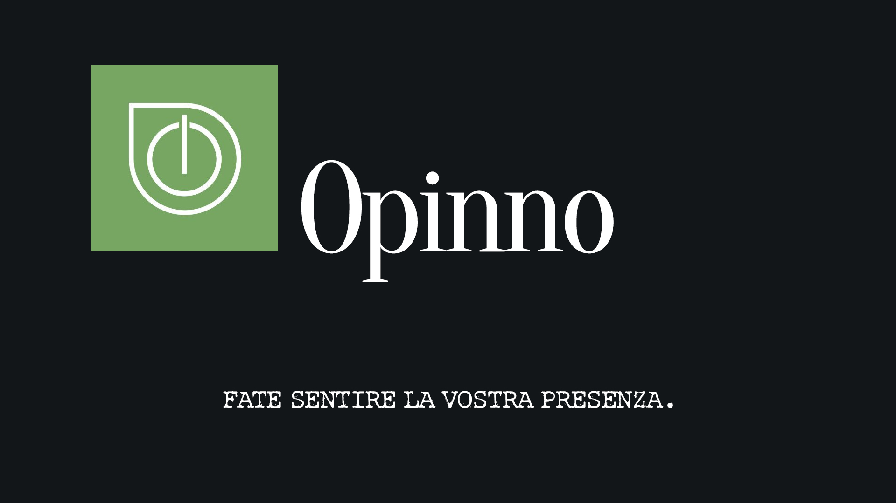

<h1 align="center"> Opinno </h1>

Fate sentire la vostra presenza.

Corso AWS

  <a href="#-tecnologias">Tecnologias</a>&nbsp;&nbsp;&nbsp;|&nbsp;&nbsp;&nbsp;
  <a href="#-progetto">Progetto</a>&nbsp;&nbsp;&nbsp;
  

  

 

## 🚀 Tecnologia

Questo progetto è stato sviluppato utilizzando le seguenti tecnologie:

- HTML e CSS
- JavaScript
- Git e Github

## 💻 Progetto
L'obiettivo di questo progetto è quello di confermare la frequenza online dei partecipanti al corso.

